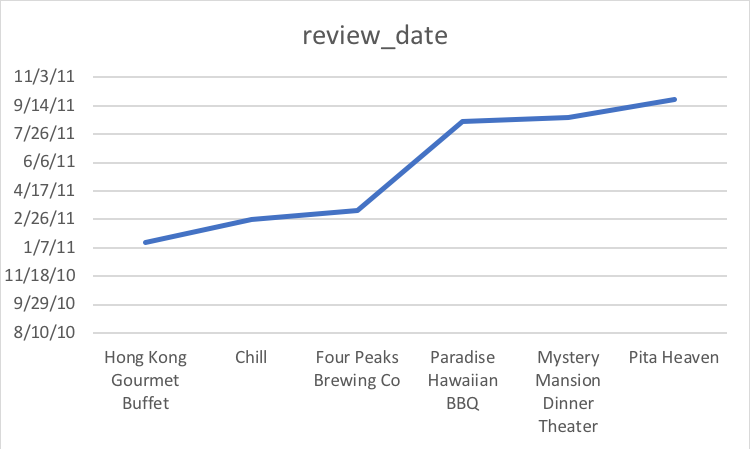
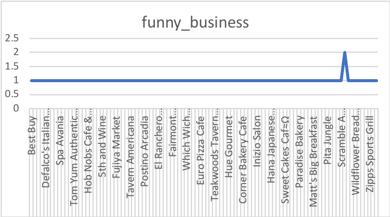
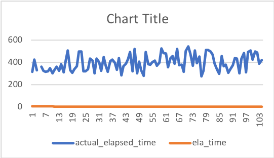
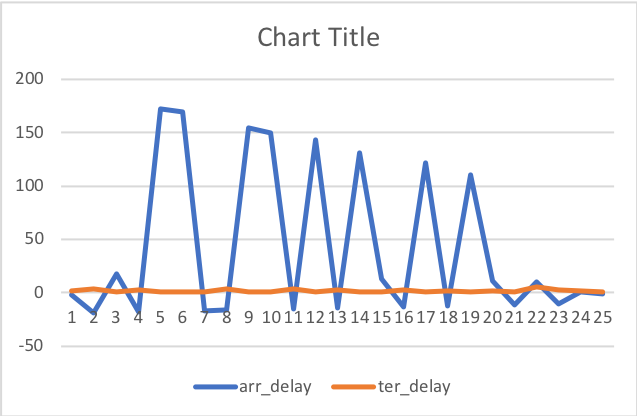

# ICA-4
Yelp: The dataset basically has a grading system to from customers, such as, star, funny, useful, and cool base on their checkin and checkout date.
US flight: The dataset records data like delay, weather delay or cancelled flight based on airport and fligh date. 
## Question 1
-- What businss is the coolest between 2009-05-01 and 2013-12-31

```sql
SELECT cool,
    count(business_name) as cool_business
FROM strata_user.yelp
where review_date between '2009-05-01'AND '2013-12-31' 
GROUP BY cool
ORDER BY cool DESC
```


## Question 2
-- Which business has 5 stars in 2011. What are the business?

```sql
SELECT business_name, review_date
FROM strata_user.yelp
WHERE review_date between '2011-01-01' AND '2011-12-30' and stars = '5'
ORDER BY review_date
```


## Question 3
-- what is the most funniest business?

```sql
SELECT funny, business_name,
    count(*) as funny_business
FROM strata_user.yelp
GROUP BY funny, business_name
ORDER BY funny DESC
```


## Question 4
-- Which flight has the greatest actual elapsed time

```sql
SELECT actual_elapsed_time,
count(*) as ela_time
FROM strata_user.us_f
GROUP BY actual_elapsed_time
ORDER BY ela_time DESC
```


## Question 5
-- what is the worst arr_delay

```sql
SELECT arr_delay,
count(flight_date) as ter_delay
FROM strata_user.us_f
WHERE arr_delay between '10' AND '-200'
GROUP BY arr_delay
ORDER BY arr_delay DESC
```



